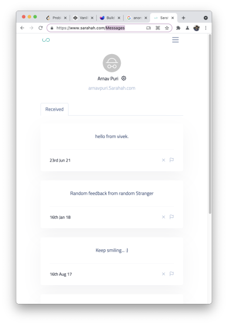
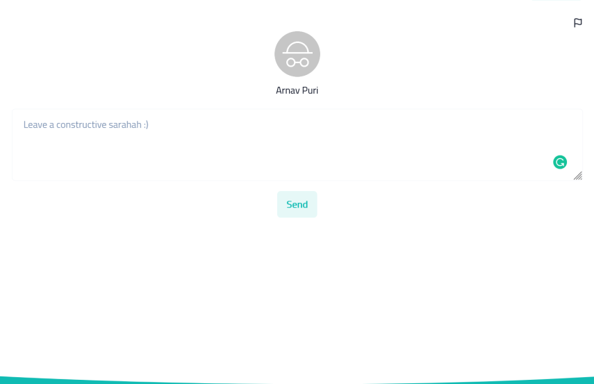

# Day 42 React Test

# Anonymous feedback website
You have been asked to create an anonymous feedback website. In this website users can signup and register for their custom feedback page.
Other users can visit this page and provide constructive anonymous feedback to the user.

### NOTE: Focus on getting the functionality right and then work on the UI if you have time left.

## User Story
Sanjay signed up on this website to see what his friends think of him behind his back. He choose the username `SanjayKp` and signed up by providing his email and selecting a password as well. Now he can share his username with others to visit his profile page to post anonymous feedback, so he gave the link to another user `Danny22`. 

Danny visits the page `/SanjayKp` and sees a form where he posts what he thinks of `SanjayKp`. 
Now when `SanjayKp` logs in again he is able to see a new feedback but he can't see who posted it. If he wants he can delete any feedback.

## Deliverable Screens
- SignUp (will need username, email and password)
- Login (If you want to combine them in single page, you can do so, be creative about it)
- Profile page (with list of feedbacks loggedin user has received)
- Feedback form page (to provide feedback to another user)

# Part 1
## Signup page design
- You will need a username field too so that each user can be assigned with a unique feedback page from where they can collect feedbacks.
You need to ensure that username is unique. Two users can't have the same username.

##  Login page design
- Login through email and password.

# Part 2
## Profile page design

Notice that we are displaying the Username on the top of the page, and there is a delete icon for each feedback card. You can ignore the flag icon.

## Feedback page design
Anyone can give the feedback if they have the link

## Tech stack
- React
- Firebase (as backend)
- Redux or Context API (optional)

You can use any third party UI Library if you want to.
